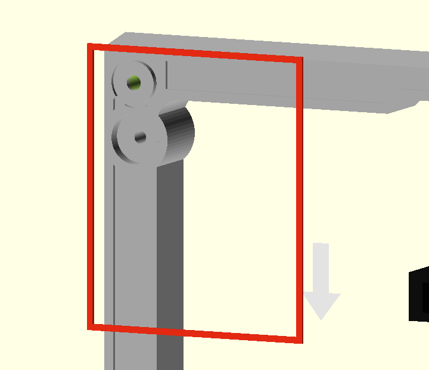
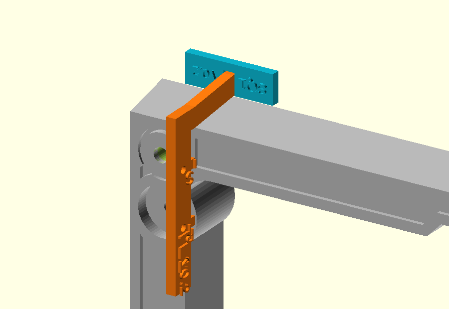

# SQ-01 — TL1 haaks plaatsen met SQ1

**Vraag**

Kan **SQ1 v0.2** de **TL1 v0.2** zonder forceren of verdraaien haaks en herhaalbaar op de linkerbovenhoek van het paneel plaatsen?

Deze testcase controleert alleen de plaatsing. Of het TL1-profiel bij het paneel past, hoort in een aparte testcase.

**Benodigd**

- één fysiek P5 64 × 32-paneel;
- geprinte TL1 v0.2;
- geprinte SQ1 v0.2;
- telefoon of camera;
- sample-ID.

**Vooraf**

Plaats het paneel met de achterzijde/elektronicazijde naar je toe en de 320 mm-richting verticaal. Gebruik de fysieke linkerbovenhoek uit de afbeelding hieronder.

| # | Handeling | Verwacht |
| ---: | --- | --- |
| 1 | Schuif SQ1 over TL1. | SQ1 schuift zonder kracht over TL1. Enige speling in de sleuf is toegestaan. |
| 2 | Plaats SQ1 op het rechte voorste deel van de bovenrand, bij de linkerbovenhoek. | SQ1 rust op de bedoelde rand en TL1 wijst over de diepte van het paneel. |
| 3 | Laat beide delen met lichte handdruk vanzelf gaan zitten. Verdraai TL1 niet om hem passend te laten lijken. | SQ1 zit natuurlijk op de rand en houdt TL1 ongeveer haaks op de bovenrand. |
| 4 | Neem beide delen weg en herhaal de plaatsing drie keer. | Dezelfde positie en oriëntatie zijn iedere keer terug te vinden. |
| 5 | Controleer voorzichtig of SQ1 duidelijk wiebelt. | Geen duidelijke wiebel. Bij wiebelen of twijfel: noteer `investigate` en maak een detailfoto. |
| 6 | Noteer het resultaat en maak één foto van de geplaatste delen. | De registratie bevat een resultaat, waarneming en verwijzing naar het bewijs. |

**Registratie**

- Sample: `...`
- Datum: `...`
- Resultaat: `agrees` / `investigate` / `not checked`
- Waargenomen: `...`
- Bewijs: `...`
- Vervolg: `...`
